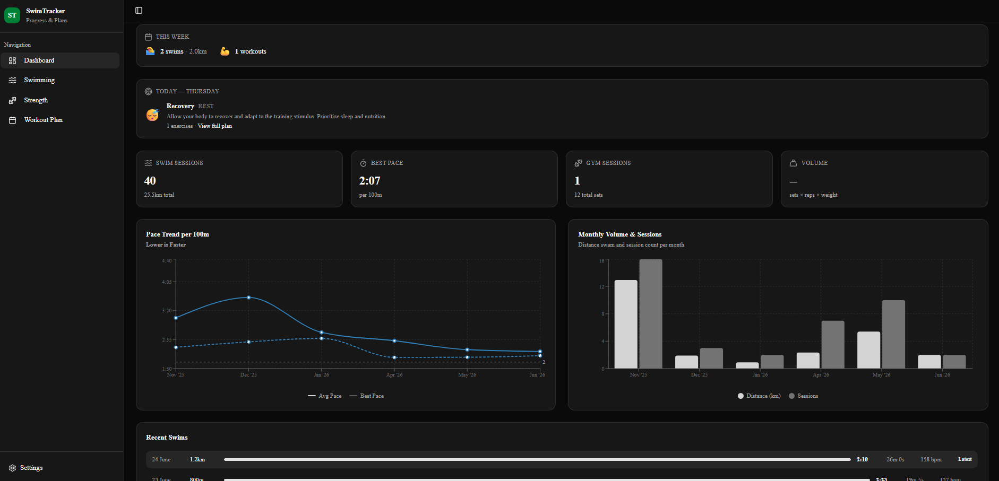
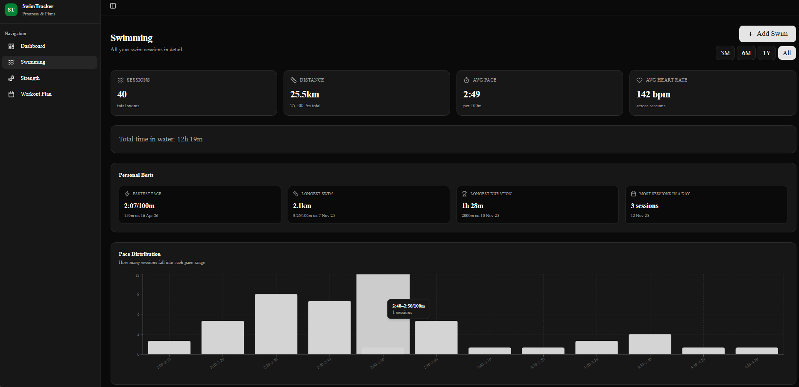
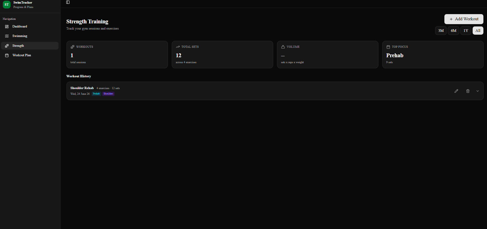
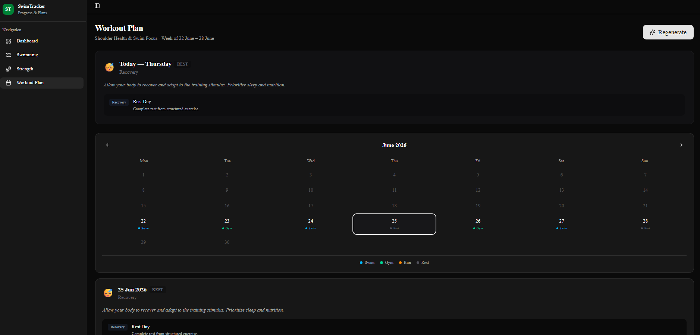

# RenanganApp - Swim Tracker

A personal swim and strength training tracker with AI-powered workout planning. Built with Next.js, Tailwind CSS, and Gemini AI.

## Screenshots

### Dashboard
Track your weekly progress, today's workout, swim pace trends, and training volume at a glance.



### Swimming
Log swim sessions, view personal bests, pace distribution, and full session history with sorting and pagination.



### Strength Training
Track gym workouts with exercises, sets, reps, and weights. Color-coded muscle group tags and expandable workout cards.



### Workout Plan
AI-generated weekly plans based on your actual training data. Calendar view with color-coded days — click any day to see the full workout.



## Features

- **Dashboard** — weekly summary, today's workout, stats cards, pace trend & volume charts
- **Swimming** — add/edit/delete swims, personal bests, pace distribution, sortable table
- **Strength** — add/edit/delete workouts with dynamic exercise lists, category tags
- **Workout Plan** — AI-generated weekly plans via Gemini API, calendar view, past plan history
- **AI Insights** — data-driven analysis of your training progress (persistent across sessions)
- **Training Notes** — persistent context notes sent to AI (injuries, goals, untracked training)
- **Login** — password-protected access
- **PWA** — installable on mobile as a home screen app
- **Dark Mode** — clean dark theme, no generic gradients

## Tech Stack

| Layer | Technology |
|-------|-----------|
| Frontend | Next.js 16, TypeScript, Tailwind CSS, shadcn/ui |
| Charts | Recharts |
| Database | Prisma 7, SQLite (local) / Turso (cloud) |
| AI | Google Gemini API |
| Deployment | Docker, Google Cloud Run |

## Quick Start

```bash
# Clone and install
git clone <your-repo-url>
cd swim-tracker
npm install

# Set up environment
cp .env.example .env
# Edit .env with your keys (see below)

# Generate Prisma client
npx prisma generate

# Create local database
npx prisma migrate dev

# Start dev server
npm run dev
```

Open http://localhost:3000 and log in with your `APP_PASSWORD`.

## Environment Variables

Create a `.env` file (see `.env.example`):

```env
# Database — local SQLite for development
DATABASE_URL="file:./dev.db"

# Or Turso for cloud persistence
# DATABASE_URL="libsql://your-db.turso.io"
# TURSO_AUTH_TOKEN="your-token"

# Gemini API — https://aistudio.google.com/apikey
GEMINI_API_KEY="your-key"

# App login password
APP_PASSWORD="your-password"

# API secret — generate with: openssl rand -hex 16
API_SECRET="your-secret"
NEXT_PUBLIC_API_TOKEN="same-as-api-secret"
```

## Docker

```bash
docker build -t swim-tracker .

docker run -p 8080:8080 \
  -e DATABASE_URL="file:./dev.db" \
  -e GEMINI_API_KEY="your-key" \
  -e APP_PASSWORD="your-password" \
  -e API_SECRET="your-secret" \
  -e NEXT_PUBLIC_API_TOKEN="your-secret" \
  swim-tracker
```

## Mobile

The app is a PWA — open it in Chrome on your phone, tap the menu, and select "Add to Home Screen". It runs fullscreen like a native app.

## Cloud Deployment

Works with Google Cloud Run + Turso for persistent data. See `documentation.md` for full deployment guide.
